# 🎓 Student Registration System

## 📌 Project Overview
This project is a **University Student Registration System** developed in **three phases**, each adding new data structures and improving the functionalities for student registration and course management.

---

## 🚀 Phase 1 - Stack Version

### 📂 Data Structures Used
- **Stack** → To store registered students (LIFO order).
- **Queue** → To store courses for each student.
- **Map** → To map student IDs to their enrolled courses.

### ⚙️ Main Features
- Register a new student (added to the top of the stack).
- Remove the first registered student (pop from stack).
- Display all students.
- Register courses for students.
- Display courses of a specific student.

---

## 🚀 Phase 2 - List Version

### 📂 Improvements
- Replaced **Stack** with **List** for better flexibility.
- Ability to **delete a student by ID** directly.
- Improved menu and user interaction.

### 📂 Data Structures Used
- **List** → To store students dynamically.
- **Queue** and **Map** → Maintained for course management.

### ⚙️ Main Features
- Add a student at any position.
- Delete a student by ID.
- Maintain courses for each student.
- Display student records more efficiently.

---

## 🚀 Phase 3 - BST (Binary Search Tree) Version

### 📂 Key Additions
- Introduced **Binary Search Tree (BST)** for fast and efficient student searching.
- Ability to display students in **In-order**, **Pre-order**, and **Post-order** traversals.
- Advanced search functionality based on student IDs.
- Maintained **List** to preserve order of insertion.

### 📂 Data Structures Used
- **BSTNode** class for tree structure.
- **List**, **Queue**, **Map** for complete data handling.

### ⚙️ Main Features
- Insert, delete, and search for students using BST.
- Display data with different traversal methods.
- Combine list order with BST search efficiency.
- Manage courses dynamically per student.

---

# 📂 Project Structure

---

# 📸 Phase 3 

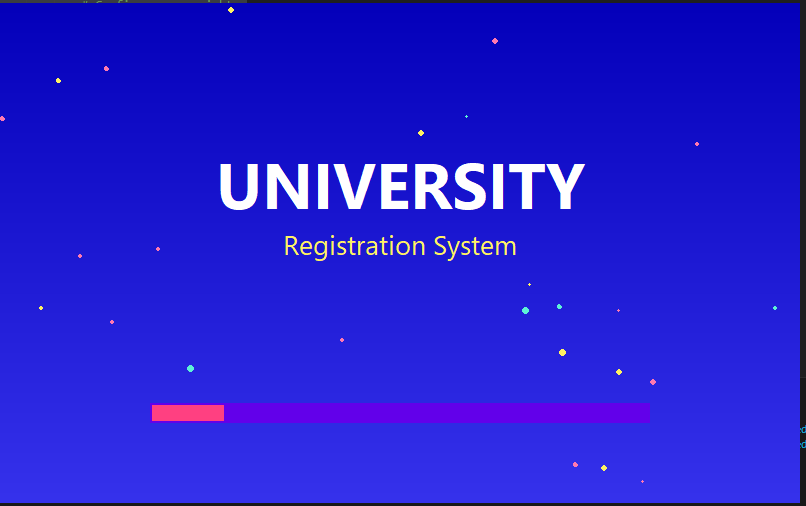
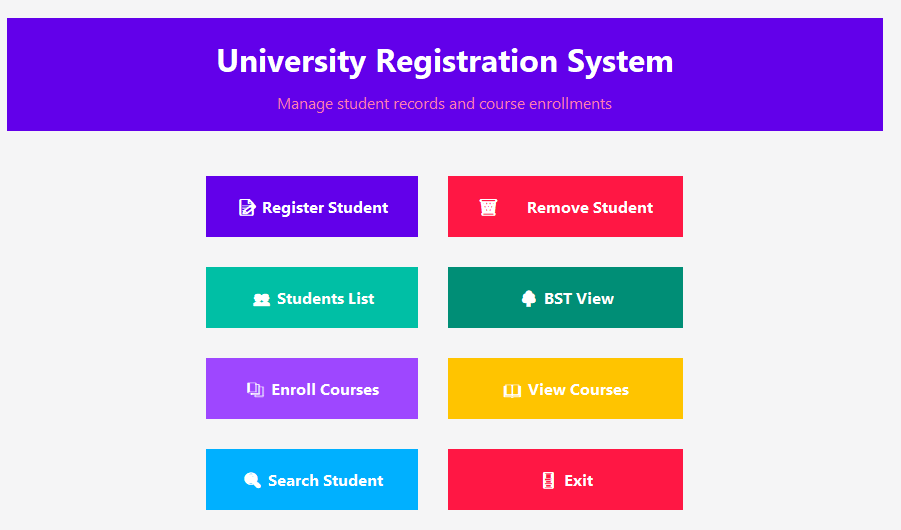
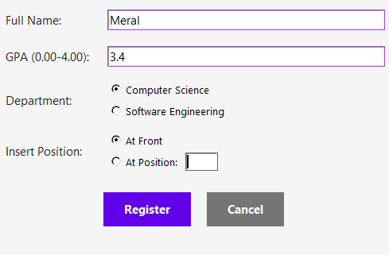
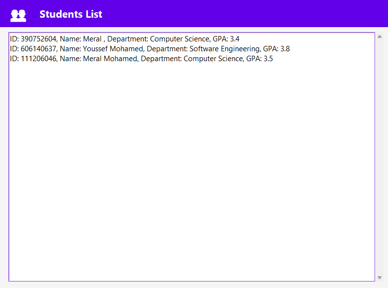
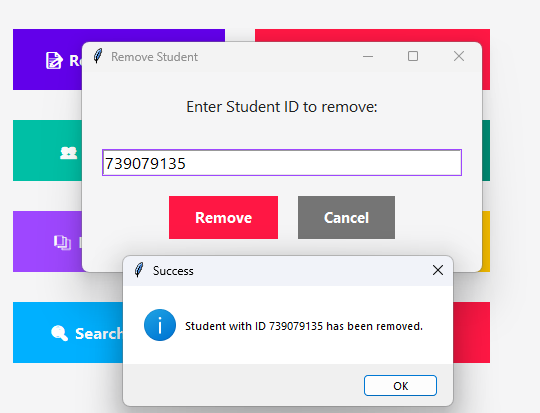

---

# 📸 Phase 2 

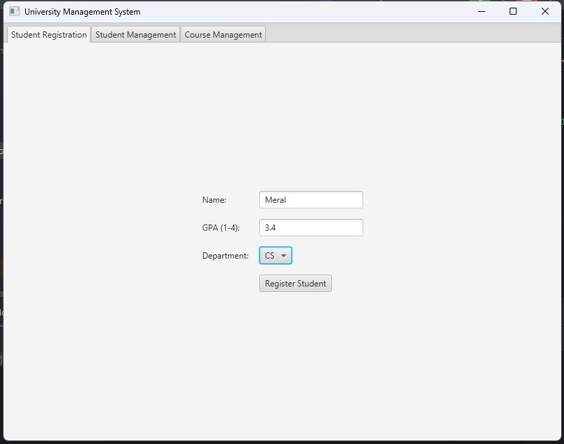
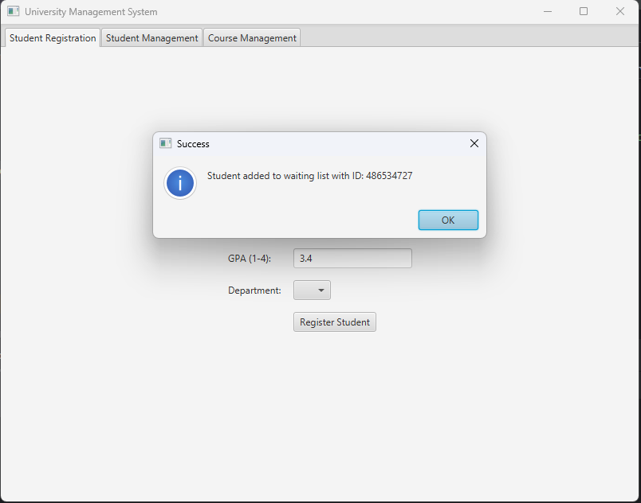
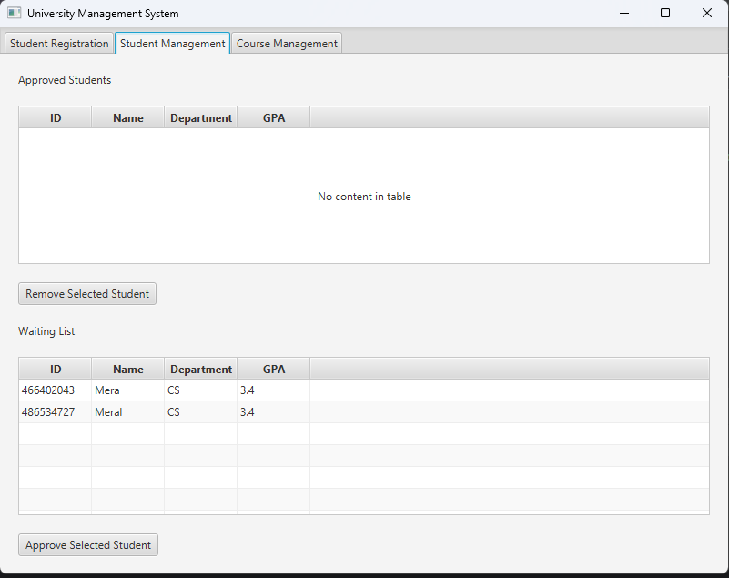
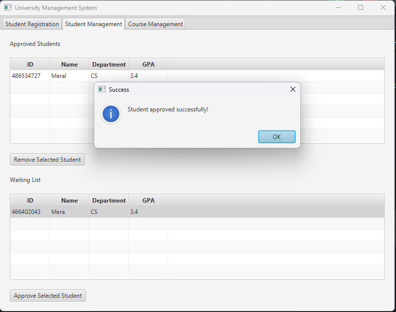
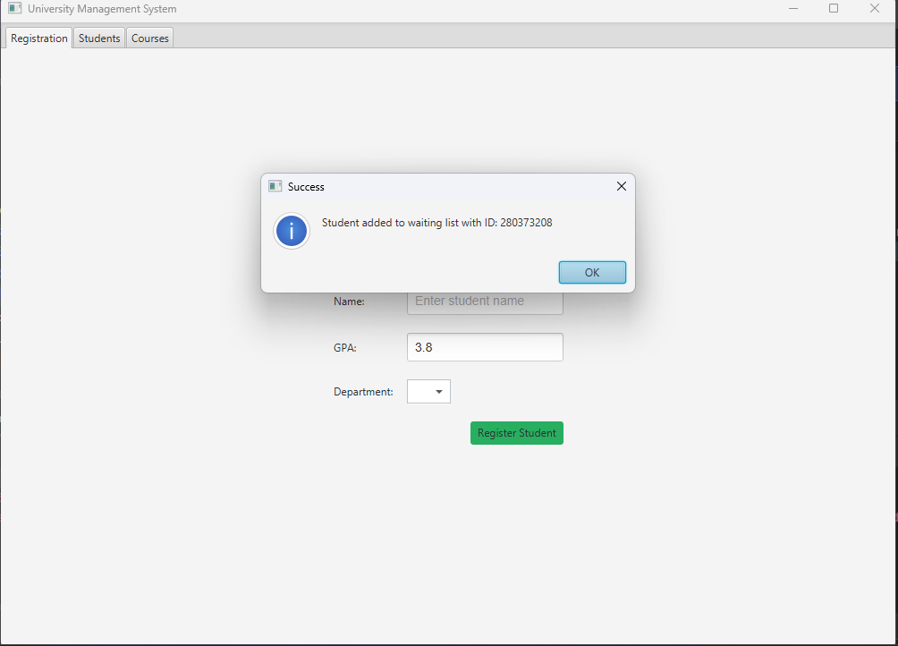
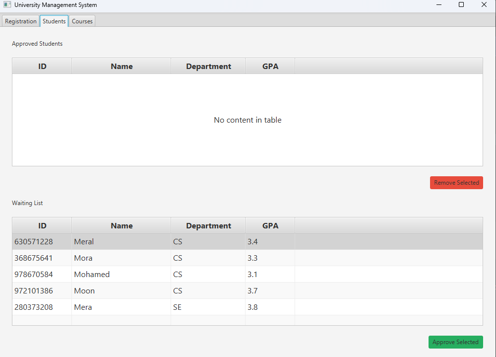
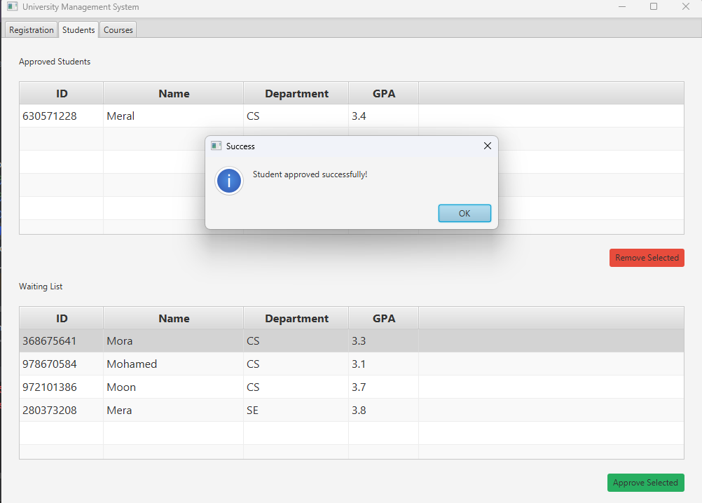
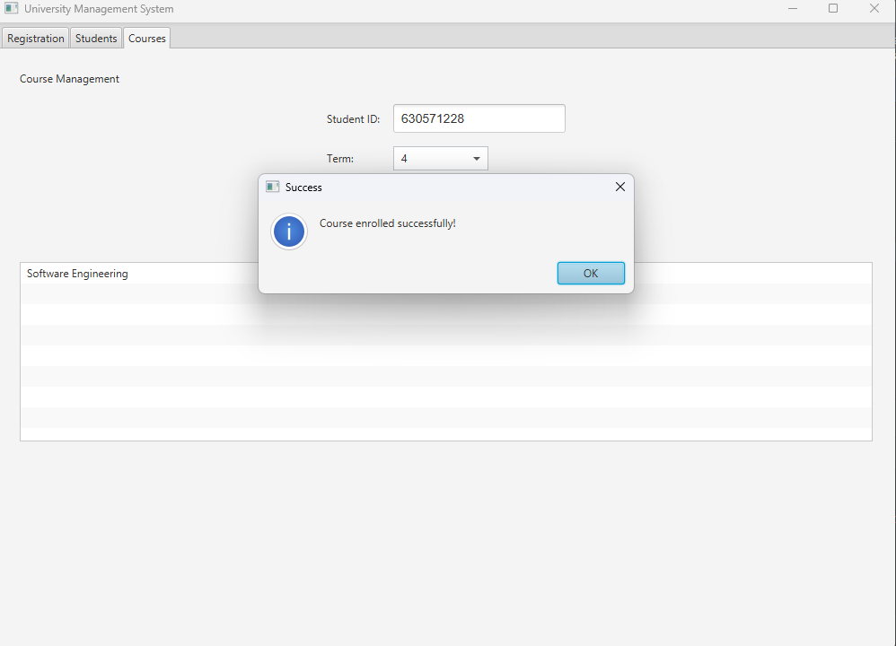
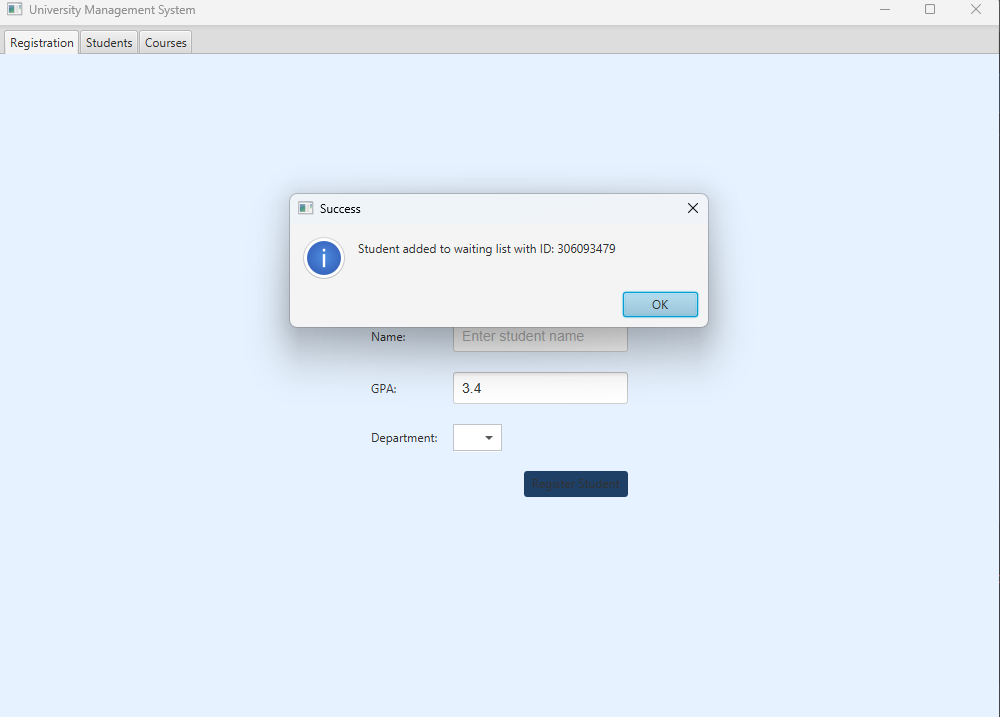
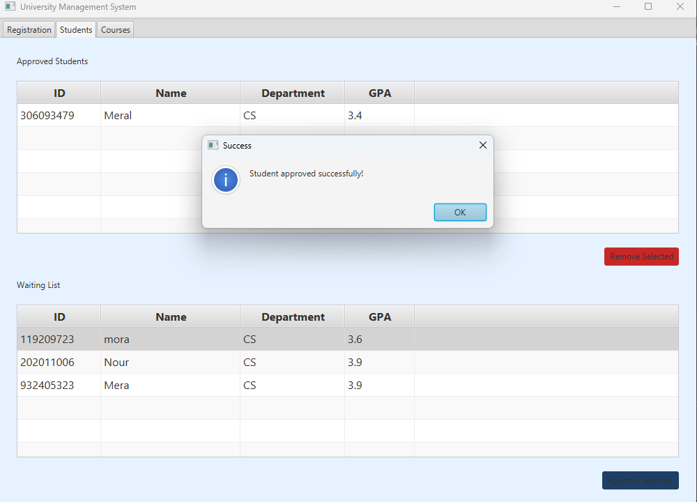
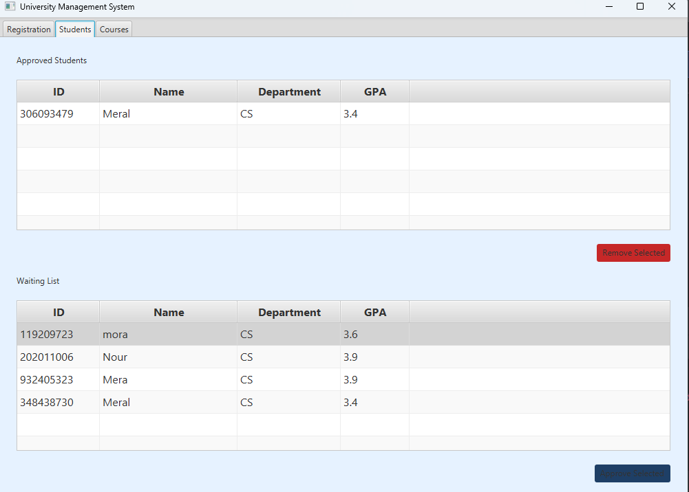
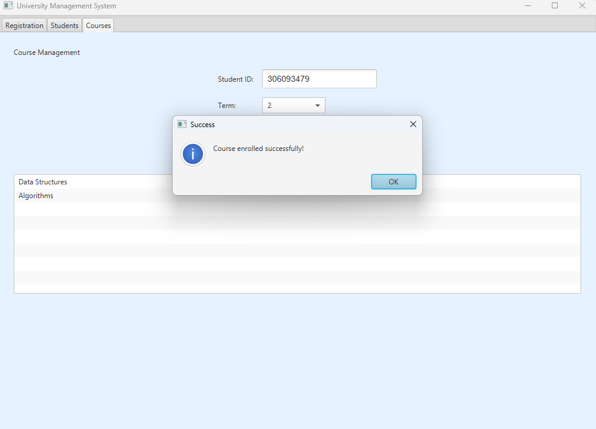
